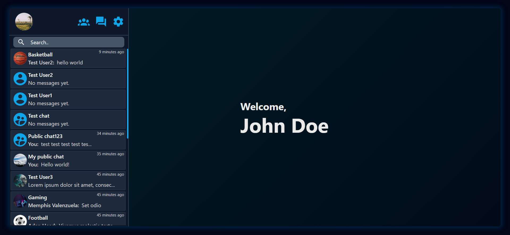
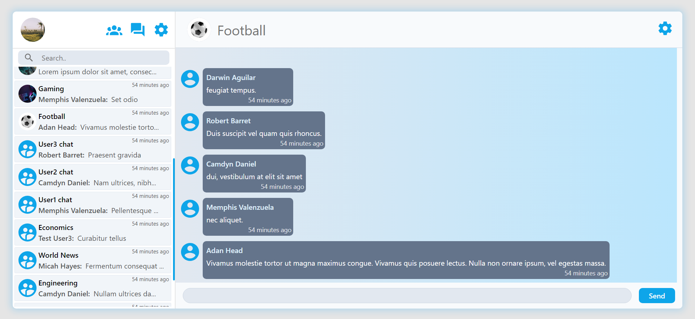
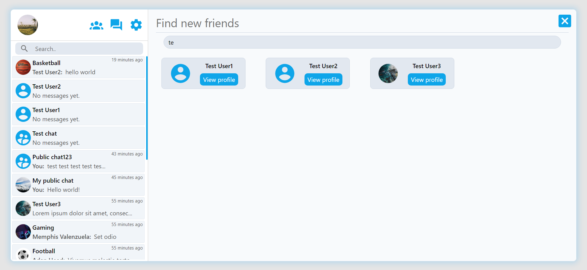

# MessageApp

Deployed app: https://cheery-peony-2b91b4.netlify.app/

## Description

This is the last React exercise in Odin project's Ruby on Rails course, where i created a full-stack chatting application with basic core features.

This repo is frontend.
Backend repo: https://github.com/99vik/messaging-app-API

Exercise link: https://www.theodinproject.com/lessons/react-new-messaging-app

## Technologies

- Rails API (for backend)
- Vite
- React
- Tailwind

## Features

- Authentication

  - Used famous Rails gem called Devise for user authentication, cause I only built rails backend as an API app, some additional changes were necessary. I used devise-api gem, which is another layer built on top of devise for authentication through JavaScript API calls by sending user authentication tokens. Although this gem made it pretty easy to authenticate users and get their user object in the backend, configuring it was kinda difficult just because it's relatively new (compared to jwt for example) and there just isn't much info on the web.

- Chats

  - There are 3 types of chats, public (where everyone can join), private (where you need to be added by admin) and direct (for direct messaging between users).
  - WebSocket connection is established on logging in, where you automatically refresh your chats on new received message. The same thing happens on opening specific chat.
  - Users can create public and private chats, where they are manage participants and edit chat's name and photo

- Profiles

  - Users can edit their profile photo, username(has to be unique) and description.
  - You can open user's profile in a chat he has joined, or you can search for profiles in a Search Profiles Tab.

- Friendships

  - Users can send each other friend requests, on accepting friend request direct chat between users is created, also it is destroyed on removing a user as a friend.

- Dark theme
